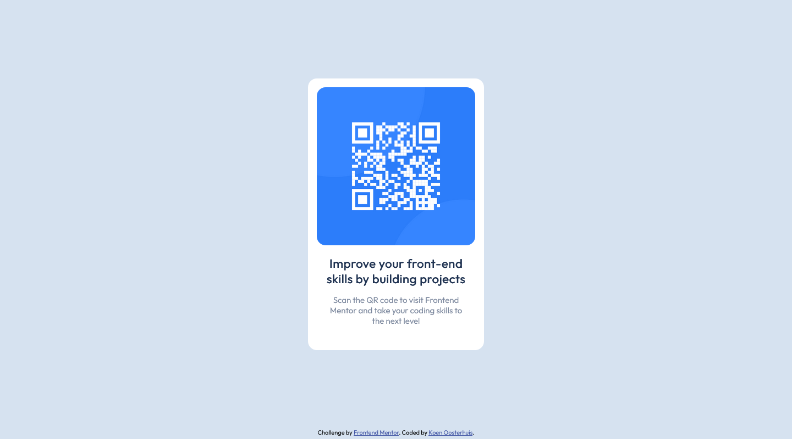

# Frontend Mentor - QR code component solution

This is a solution to the [QR code component challenge on Frontend Mentor](https://www.frontendmentor.io/challenges/qr-code-component-iux_sIO_H). Frontend Mentor challenges help you improve your coding skills by building realistic projects. 

## Table of contents

- [Overview](#overview)
  - [Screenshot](#screenshot)
  - [Links](#links)
- [My process](#my-process)
  - [Built with](#built-with)
  - [What I learned](#what-i-learned)
  - [Continued development](#continued-development)
  - [Useful resources](#useful-resources)
- [Author](#author)

## Overview

### Screenshot




### Links

- [Solution URL](https://github.com/koeno100/qr-code-component)
- [Live Site URL](https://koeno100.github.io/qr-code-component)

## My process

### Built with

- Semantic HTML5 markup
- Flexbox

### What I learned

In this challenge, I learned the basics of layering HTML elements and styling them to get to this static final result. Since this is my first challenge, I learnt how to work with flexbox for the first time, how to position it to the middle of the page and a little extra challenge was how to get the attribution line to end up at the bottom of the page.

Not exactly part of the challenge but still very helpful was that I learned how to use Git and GitHub and how I could publish this challenge to my GitHub Pages URL. 

What was especially useful is learning how to create a flexbox and then positioning the card in the middle of the page, while positioning the attribution at the bottom of the page. To do this, I used ```margin-top: auto``` for both the card and attribution line:

```css
body {
	(...)
	display: flex;
	flex-direction: column;
	align-items: center;
}

main, footer {
	margin-top: auto;
}
```

### Continued development

I would like to continue practicing with the flexboxes and dive into more complicated responsive designs than this one.

### Useful resources

- [Git & GitHub Crash Course For Beginners](https://www.youtube.com/watch?v=SWYqp7iY_Tc) - This was a really nice comprehensive video to get into Git and GitHub. It explains all the basics you need to use Git and GitHub.
- [Bottom Align an Element with Flexbox](https://www.culturefoundry.com/cultivate/technology/bottom-align-an-element-with-flexbox/) - This source helped me figure out how to align the footer to the bottom of the page while keeping the card centered.

## Author

- Frontend Mentor - [@koeno100](https://www.frontendmentor.io/profile/koeno100)
